# Technical Program Management (TPM) — Comprehensive Reference Guide & Playbook

> A curated, premium collection of technical program management resources, domain playbooks, templates, execution frameworks, and interview prep guides for Technical Program Managers (TPMs) scaling complex software systems, infrastructure, and organizations.

---

## 📋 Table of Contents

- [Overview & The TPM Role](#overview--the-tpm-role)
- [TPM vs. PM vs. EM](#tpm-vs-pm-vs-em)
- [Career Matrix & Progression](#career-matrix--progression)
- [Core Competencies](#core-competencies)
- [Repository Index & Guides](#repository-index--guides)
- [Curated External Resources](#curated-external-resources)
  - [Recommended Books](#recommended-books)
  - [Industry Blogs & Newsletters](#industry-blogs--newsletters)
  - [Communities & Podcasts](#communities--podcasts)
- [Contributing](#contributing)
- [License](#license)

---

## Overview & The TPM Role

A **Technical Program Manager (TPM)** is a specialized leadership role driving complex, cross-functional engineering programs from conception to delivery. Unlike general program managers, a TPM possesses strong technical depth, enabling them to:
- Translate business requirements into high-level technical specifications.
- Lead system architecture discussions and identify technical bottlenecks.
- Map complex, multi-team dependencies and resolve technical risks.
- Bridge communication gaps between product, design, engineering, and executives.

---

## TPM vs. PM vs. EM

To operate effectively, a TPM must understand their relationship to Product Managers (PMs) and Engineering Managers (EMs).

| Dimension | Product Manager (PM) | Technical Program Manager (TPM) | Engineering Manager (EM) |
| :--- | :--- | :--- | :--- |
| **Primary Focus** | **"What" and "Why"** (Strategy, Vision, Market-Fit, Product Requirements) | **"How" and "When"** (Execution, Lifecycle, Technical Dependencies, Delivery) | **"Who" and "How"** (People Management, Code Quality, Delivery Details) |
| **Scope** | Single product or feature area. | Cross-functional programs spanning multiple systems/teams. | Single engineering team or component. |
| **Success Metric** | Product adoption, user retention, revenue. | On-time delivery, risk mitigation, operational efficiency, architecture alignment. | Team health, code quality, developer velocity, career growth. |
| **Technical Depth** | High-level (User needs & UX). | High to deep-dive (System design, APIs, infra, data-flows). | Deep-dive (Design patterns, code reviews, debugging). |

---

## Career Matrix & Progression

```mermaid
gantt
    title TPM Career Trajectory & Focus Shift
    dateFormat X
    axisFormat %L
    section Technical Breadth
    Associate TPM (L4) :active, 0, 30
    Senior TPM (L6)     :active, 0, 70
    Principal TPM (L8)  :active, 0, 95
    section Program Execution
    Associate TPM (L4) :active, 0, 80
    Senior TPM (L6)     :active, 0, 90
    Principal TPM (L8)  :active, 0, 60
    section Strategic Leadership
    Associate TPM (L4) :active, 0, 20
    Senior TPM (L6)     :active, 0, 60
    Principal TPM (L8)  :active, 0, 95
```



### 1. Associate / Junior TPM (L4)
- **Focus**: Executing well-defined, single-domain projects.
- **Scope**: Working within 1-2 engineering teams.
- **Key Skill**: Task tracking, standard scrum ceremonies, clear communication.

### 2. TPM / Mid-Level (L5)
- **Focus**: Driving programs with moderate ambiguity and multiple dependencies.
- **Scope**: Working across 2-4 teams.
- **Key Skill**: Risk identification, dependency mapping, high-level system understanding.

### 3. Senior TPM (L6)
- **Focus**: Driving highly ambiguous, multi-million dollar/user initiatives.
- **Scope**: Multi-organization, cross-functional programs.
- **Key Skill**: System design contribution, critical path analysis, stakeholder influence without authority.

### 4. Staff / Principal TPM (L7 - L8)
- **Focus**: Strategic technical direction, organizational efficiency, company-wide architectures.
- **Scope**: Business unit level or company-wide.
- **Key Skill**: Driving architectural shifts (e.g., monolith to microservices, cloud migrations), executive alignment, mentorship.

---

## Core Competencies

A successful TPM balances three core pillars:

```
                  ┌───────────────────────────────┐
                  │      Technical Breadth        │
                  │ (System Design, Infra, APIs)  │
                  └──────────────┬────────────────┘
                                 │
                                 │
            ┌────────────────────┴────────────────────┐
            ▼                                         ▼
┌───────────────────────┐                 ┌───────────────────────┐
│   Program Execution   │◄───────────────►│ Strategic Leadership  │
│ (Agile, Risks, RACI)  │                 │  (Influence, OKRs)    │
└───────────────────────┘                 └───────────────────────┘
```

1. **Technical Breadth**: System design, trade-off analysis, technical risk assessment, API contract reviews, capacity planning, and architecture verification.
2. **Program Execution**: Project lifecycles, dependency management, critical path analysis, Agile/Scrum/Kanban methodologies, status reporting, and risk mitigation.
3. **Strategic Leadership**: Influence without authority, cross-team conflict resolution, strategic planning (OKRs/KPIs), executive communications, and post-mortems.

---

## Repository Index & Guides

Navigate to specific domains and tools within this repository:

### 1. Technical Domains
- 🖥️ **[System Design & Technical Architecture Guide](domains/system_design.md)** — A study guide covering distributed systems, cloud infrastructure, API architectures, microservices, databases, and compliance frameworks.

### 2. Program Execution Playbook
- 🔄 **[Execution Methodologies & Frameworks Guide](domains/execution_methodologies.md)** — Best practices for managing the program lifecycle, selecting Agile/Kanban frameworks, mapping critical paths, and mitigating program risks.

### 3. Reusable Templates & Tooling
A set of production-ready markdown templates to copy and use in your day-to-day work:
- 📑 **[Project Charter](templates/project_charter.md)** — Initialize your program, align stakeholders, and define clear goals/scope.
- 🚦 **[Weekly Status Report](templates/status_report.md)** — Structure status updates (Plans, Progress, Problems) with clear metrics.
- 👥 **[RACI Matrix](templates/raci_matrix.md)** — Map roles, responsibilities, and decision-making authority.
- ⚠️ **[Risk Register & Mitigation Log](templates/risk_register.md)** — Track risks, quantify impact/probability, and record active mitigations.
- 🔍 **[Post-Mortem & Retrospective Guide](templates/retrospective.md)** — Run constructive, blameless reviews to improve team velocity.

### 4. Career & Interview Preparation
- 💼 **[TPM Interview Prep & Study Roadmap](interview_prep.md)** — Strategies and practice resources for passing technical, program management, behavioral, and Fermi estimation interview rounds.

---

## Curated External Resources

### Recommended Books

*   **System Design & Architecture:**
    *   *Designing Data-Intensive Applications* by Martin Kleppmann (The TPM "Bible" for systems depth).
    *   *System Design Interview* (Volume 1 & 2) by Alex Xu.
*   **Program & Project Management:**
    *   *Making Things Happen: Mastering Project Management* by Scott Berkun.
    *   *Crucial Conversations: Tools for Talking When Stakes Are High* by Joseph Grenny et al.
*   **Leadership & Product:**
    *   *Staff Engineer: Leadership beyond the management track* by Will Larson.
    *   *The Mythical Man-Month* by Frederick P. Brooks Jr.

### Industry Blogs & Newsletters
- **[ByteByteGo (Alex Xu)](https://blog.bytebytego.com/)** — Excellent system design graphics and explainers.
- **[Pragmatic Engineer (Gergely Orosz)](https://blog.pragmaticengineer.com/)** — Practical insights on engineering management, TPM roles, and tech industry trends.
- **[Leni's Newsletter](https://www.lennyletter.com/)** — Product management, growth, and team alignment dynamics.
- **Engineering Blogs** (Netflix, Uber, Stripe, Airbnb) — Crucial case studies on how major tech companies build and scale systems.

### Communities & Podcasts
- **[TPM Cafe](https://tpmcafe.com/)** — Active community for TPMs to share stories, jobs, and templates.
- **[System Design Academy](https://systemdesign.one/)** — Step-by-step breakdowns of real-world system designs.
- **[Tech Lead Journal](https://techleadjournal.dev/)** — Podcast exploring technical leadership, agile delivery, and engineering excellence.

---

## Contributing

This is a living, community-driven resource. To propose additions, updates, or templates:
1. Fork this repository.
2. Create your feature branch (`git checkout -b feature/tpm-resource-addition`).
3. Commit your changes with descriptive messages.
4. Push to the branch.
5. Create a Pull Request detailing the changes and value added.

---

## License

This reference playbook is licensed under the Creative Commons Attribution 4.0 International License (CC BY 4.0). You are free to share, copy, and adapt the material as long as appropriate credit is given.

---

**Last Updated**: July 2026

**Maintained by**: [@nbajpai-code](https://github.com/nbajpai-code)
